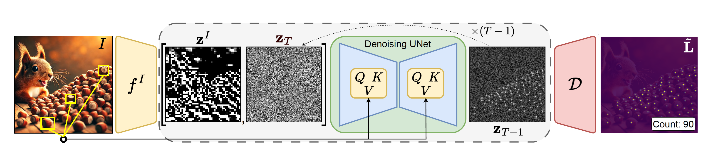
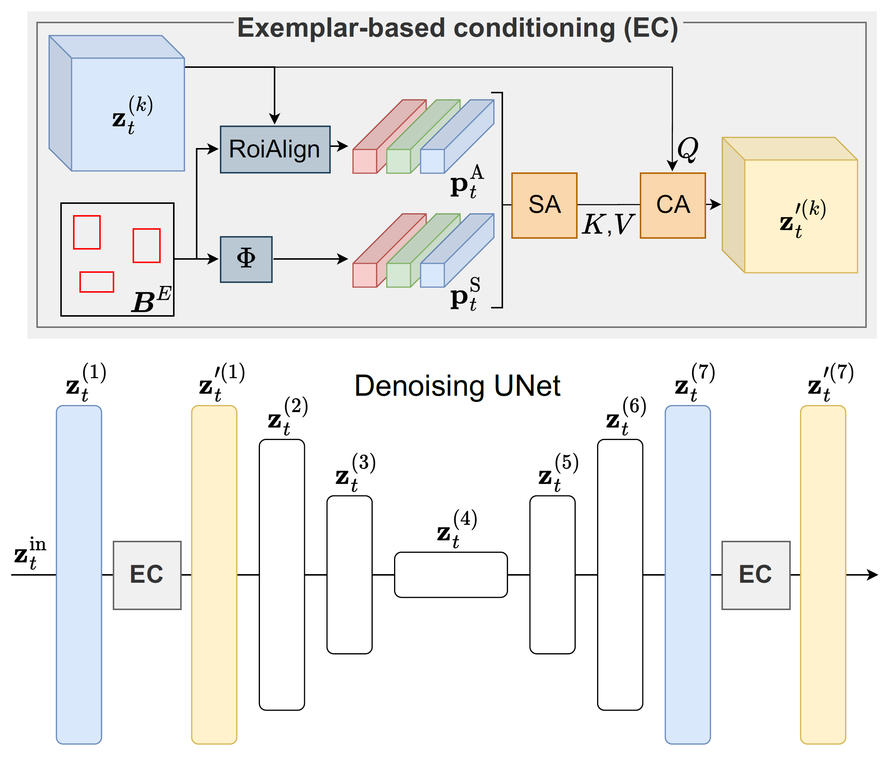

<div align="center">
<h1 align="center">CoDi - Counting with Diffusion</h1>
<h3>CoDi - Exemplar-Conditioned Diffusion Model for Low-Shot Counting</h3>

[Grega Šuštar](https://scholar.google.com/citations?user=JLJ_tAcAAAAJ), [Jer Pelhan](https://scholar.google.com/citations?user=pDLR7N8AAAAJ), [Alan Lukežič](https://scholar.google.com/citations?user=1_5im9oAAAAJ), [Matej Kristan](https://scholar.google.com/citations?user=z_8FrEYAAAAJ)

University of Ljubljana, Faculty of Computer and Information Science

[](https://arxiv.org/abs/2512.20153)


[**Overveiw**](#overview) | [**Get Started**](#get-started) | [**Reference**](#reference) | [**Questions**](#questions)

<h1> 🚧 UNDER CONSTRUCTION 🚧 </h1>
</div>


## Overview

This repository contains the official PyTorch implementation of **CoDi - Exemplar-Conditioned Diffusion Model for Low-Shot Counting**

CoDi generates high-quality density maps using latent diffusion model, enabling accurate object localization via non-maxima suppression. 

<p align="center">
    
</p>

The key innovation is an exemplar-based conditioning module that extracts and adapts object prototypes within the denoising network’s intermediate layers, significantly improving location estimation.

<p align="center">
    
</p>


https://github.com/user-attachments/assets/81591480-3e0f-49b2-8679-b93b941aa747


## Get Started

### Environment setup

Create a Python environment and install required packages:

```bash
conda create -n codi python=3.10
conda activate codi

pip install -r requirements.txt
```

### Download the datasets

Download the [FSC147](https://github.com/cvlab-stonybrook/LearningToCountEverything) and [MCAC](https://github.com/ActiveVisionLab/MCAC?tab=readme-ov-file) datasets as instructed in their official repositories. For the **FSC147** datasets, make sure to also download the `annotation_FSC147_384.json` and `Train_Test_Val_FSC_147.json` and place them alongside the image directory (`images_384_VarV2`) in the directory of your choice.

### Checkpoints:

The checkpoints are available on [Google drive](https://drive.google.com/drive/folders/1n-gM3flvHIalTrdzrDu9vDqHgb7makOm?usp=sharing).

### Training, Sampling and Evaluation

Before running any of the following scripts, make sure to replace the `datadir` path in the config files to point to your data directory folder. For additional arguments check the `train.py`, `sample.py` and `eval.py` scripts.

#### Training
```
./run_train.sh configs/config_codi.yaml
```

#### Sampling

For sampling on the **MCAC** dataset, create a new folder `sample` (in the same directory as `train`, `val` and `test`) with all the images you would like to sample on (or just copy the contents of  `val` and  `test` into it).

```
python sample.py \
    --expdir ../CoDi_ckpts/codi/ \
    --checkpoint model000150_codi.pt \
    --use_fp16 \
    --allow_resizing \
    --allow_ttn \
    --ids image-ids \                   # 7 6653 1123 ... 
    --timestep_respacing 25
```

#### Evaluation
```
python eval.py 
    --expdir ../CoDi_ckpts/codi/ \
    --checkpoint model000150_codi.pt \
    --use_fp16 \
    --allow_resizing \
    --allow_ttn \
    --timestep_respacing 25
```

### Results

<p align="center">
    
</p>


## Reference

If you found this work useful, consider citing our paper and giving this repo a ⭐ 😃

```bibtex
@misc{sustar2025codi,
  author={Grega Šuštar, Jer Pelhan, Alan Lukežič, Matej Kristan},
  title={CoDi - Exemplar-Conditioned Diffusion Model for Low-Shot Counting}, 
  year={2025},
  eprint={2512.20153},
  archivePrefix={arXiv},
  primaryClass={cs.CV},
  url={https://arxiv.org/abs/2512.20153}, 
}
```

## Questions

For issues or questions, please open a GitHub [issue](https://github.com/gsustar/CoDi/issues) or email the author directly.
