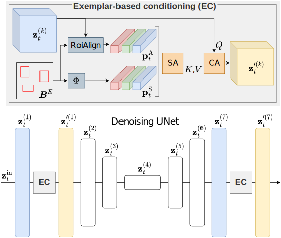

<h1 align="center">CoDi - Counting with Diffusion</h1>
<h3>CoDi - Exemplar-Conditioned Diffusion Model for Low-Shot Counting</h3>

[Grega Šuštar](https://scholar.google.com/citations?user=JLJ_tAcAAAAJ), [Jer Pelhan](https://scholar.google.com/citations?user=pDLR7N8AAAAJ), [Alan Lukežič](https://scholar.google.com/citations?user=1_5im9oAAAAJ), [Matej Kristan](https://scholar.google.com/citations?user=z_8FrEYAAAAJ)

University of Ljubljana, Faculty of Computer and Information Science

[**Overveiw**](#overview) | [**Get Started**](#get-started) | [**Results**](#results) | [**Reference**](#reference) | [**Questions**](#questions)

<h1> 🚧 UNDER CONSTRUCTION 🚧 </h1>

## Overview

This repository contains the official PyTorch implementation of **CoDi - Exemplar-Conditioned Diffusion Model for Low-Shot Counting**

CoDi generates high-quality density maps using latent diffusion, enabling accurate object localization via non-maxima suppression. 

    

The key innovation is an exemplar-based conditioning module that extracts and adapts object prototypes within the denoising network’s intermediate layers, significantly improving location estimation.

    

